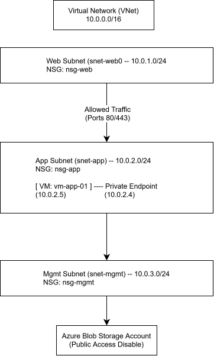

# Azure Secure Cloud Network Foundation

An enterprise-grade, zero-trust network infrastructure built on Microsoft Azure. This project demonstrates core competencies in cloud networking, micro-segmentation, identity and access management (IAM), PaaS service isolation via Private Endpoints, and diagnostic troubleshooting using Azure Network Watcher—engineered entirely within strict cost-protection and free-tier boundaries.

---

## Architecture Overview

The topology implements a 3-tier segmented Virtual Network (`10.0.0.0/16`) designed to enforce least-privilege traffic flow and eliminate public IP exposure for sensitive backend and PaaS resources.

### Network Topology Details
* **Virtual Network:** `vnet-foundation-eastus` (`10.0.0.0/16`)
* **Subnets:**
  * `snet-web` (`10.0.1.0/24`) — Public-facing web tier / ingress boundary.
  * `snet-app` (`10.0.2.0/24`) — Isolated application logic tier housing compute resources.
  * `snet-mgmt` (`10.0.3.0/24`) — Dedicated management and jumpbox subnet.
* **Storage Isolation:** Private Endpoint (`10.0.2.4`) attached to `stnetfoundation` Blob service with public access completely disabled.

---
