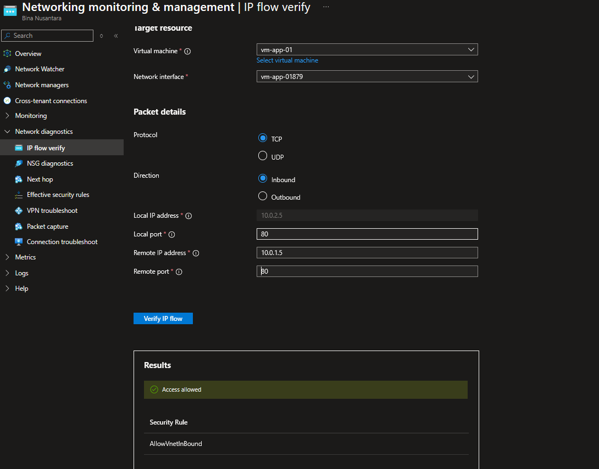
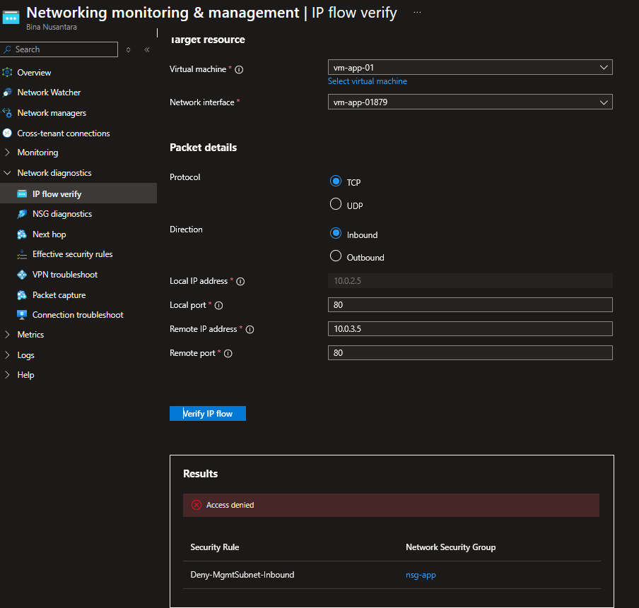
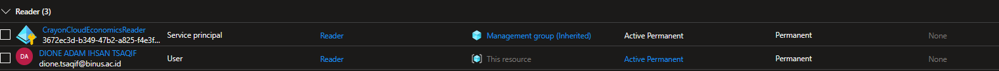

# Azure Secure Cloud Network Foundation

An enterprise-grade, zero-trust network infrastructure built on Microsoft Azure. This project demonstrates core competencies in cloud networking, micro-segmentation, identity and access management (IAM), PaaS service isolation via Private Endpoints, and diagnostic troubleshooting using Azure Network Watcher—engineered entirely within strict cost-protection and free-tier boundaries.

---

## Architecture Overview

The topology implements a 3-tier segmented Virtual Network (`10.0.0.0/16`) designed to enforce least-privilege traffic flow and eliminate public IP exposure for sensitive backend and PaaS resources.


### Network Topology Details
* **Virtual Network:** `vnet-foundation-eastus` (`10.0.0.0/16`)
* **Subnets:**
  * `snet-web` (`10.0.1.0/24`) — Public-facing web tier / ingress boundary.
  * `snet-app` (`10.0.2.0/24`) — Isolated application logic tier housing compute resources.
  * `snet-mgmt` (`10.0.3.0/24`) — Dedicated management and jumpbox subnet.
* **Storage Isolation:** Private Endpoint (`10.0.2.4`) attached to `stnetfoundation` Blob service with public access completely disabled.

---

## Security Architecture & Technical Design

### 1. Network Micro-Segmentation & NSG Logic
Each subnet is bounded by a dedicated Network Security Group (NSG). The Application Subnet (`nsg-app`) enforces explicit ingress filtering to prevent unauthorized lateral movement:

| Priority | Rule Name | Source | Destination | Port/Protocol | Action | Intent / Rationale |
| :--- | :--- | :--- | :--- | :--- | :--- | :--- |
| **100** | `Allow-WebSubnet-Inbound` | `10.0.1.0/24` (Web) | `Any` | `80, 443 / TCP` | **Allow** | Permits necessary ingress web traffic from web tier. |
| **200** | `Deny-MgmtSubnet-Inbound` | `10.0.3.0/24` (Mgmt) | `Any` | `* / Any` | **Deny** | Enforces strict tier isolation; prevents lateral access from management. |
| **65000** | `AllowVnetInBound` | `VirtualNetwork` | `VirtualNetwork` | `* / Any` | **Allow** | Default Azure VNet inter-subnet system routing rule. |

### 2. PaaS Isolation via Private Endpoints
* **Public Access Block:** Storage account public endpoint disabled at network firewall layer.
* **Internal Routing:** Private Endpoint creates a Virtual Network Interface (NIC) inside `snet-app` (`10.0.2.4`) connected via Azure Private Link.
* **DNS Integration:** Utilizes `privatelink.blob.core.windows.net` Private DNS Zone for internal name resolution.

### 3. Identity & Role-Based Access Control (RBAC)
* Access constrained using **Azure RBAC** at the **Resource Group scope** (`rg-network-foundation-prod`).
* Implemented **Principle of Least Privilege (PoLP)** by assigning non-administrative **Reader** roles for audit and monitoring workflows.

---

## Validation & Diagnostics (Network Watcher)

Verification of security boundary enforcement and network routing paths using Azure Network Watcher diagnostic suite.

### 1. Inbound Traffic Verification (IP Flow Verify)

* **Allowed Inbound Traffic Test (Web Tier $\rightarrow$ App Tier):**
  Simulating HTTP traffic originating from `snet-web` (`10.0.1.5:80`) to `vm-app-01` (`10.0.2.5:80`).
  * **Result:** `Access allowed`
  * **Matched Rule:** `Allow-WebSubnet-Inbound` (Priority 100)

  

* **Denied Inbound Traffic Test (Mgmt Tier $\rightarrow$ App Tier):**
  Simulating non-compliant traffic originating from `snet-mgmt` (`10.0.3.5:80`) to `vm-app-01` (`10.0.2.5:80`).
  * **Result:** `Access denied`
  * **Matched Rule:** `Deny-MgmtSubnet-Inbound` (Priority 200)

  

---

### 2. Private Link Route Verification (Next Hop)

Verifying packet delivery path from application VM (`10.0.2.5`) to Storage Account Private Endpoint (`10.0.2.4`).

* **Target Destination:** `10.0.2.4`
* **Evaluated Next Hop Type:** **`PrivateEndpoint`**
* **Route Table:** `System Route`
* **Technical Proof:** Confirms zero-internet exposure; traffic is natively encapsulated and delivered across Azure backbone routing tables.


---

### 3. Resource Group & IAM Role Assignment View

Scoped **Reader** role assignment applied at resource group layer (`rg-network-foundation-prod`).



---

## Cost-Aware Engineering & Governance

To maintain financial discipline in production environments, this project was architected with strict financial controls:

1. **Automated Cost Safeguards:** Azure Cost Management budget alerts configured at **$5.00 threshold** with multi-tier alerts at 50%, 80%, and 100%.
2. **Compute Optimization:** VM provisioned using **Standard_B1s** tier (1 vCPU, 1 GiB RAM) with immediate deallocation (`Stopped (deallocated)`) post-testing to eliminate compute charges.
3. **Clean Lifecycle Management:** All project dependencies deployed in a single target Resource Group (`rg-network-foundation-prod`), enabling deterministic single-operation teardowns with zero lingering passive cost leakage.

---

## Deployment & Teardown

To deploy or destroy this environment programmatically via Azure CLI:

```bash
# Set variables
RESOURCE_GROUP="rg-network-foundation-prod"
LOCATION="centralindia"

# Provision Resource Group
az group create --name $RESOURCE_GROUP --location $LOCATION

# Teardown / Cleanup all resources
az group delete --name $RESOURCE_GROUP --yes --no-wait
```
